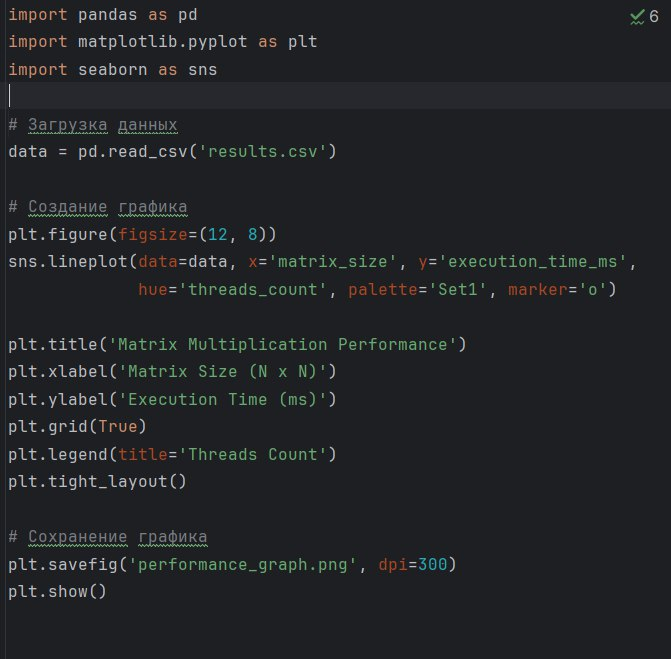

# Лабораторная работа: Параллельное умножение матриц

### На 5

### Основные структуры и функции

### Функция освобождения памяти и умножения матриц

### Распределение работы по потокам

### Завершение работы потоков и вывод результатов

## Результаты тестирования
### Пример вывода данных

## Визуализация производительности

## на 4

### 1. Исходный код программы
#### Основная структура и функция потока

#### Главная функция с созданием потоков

### 2. Результат работы программы

